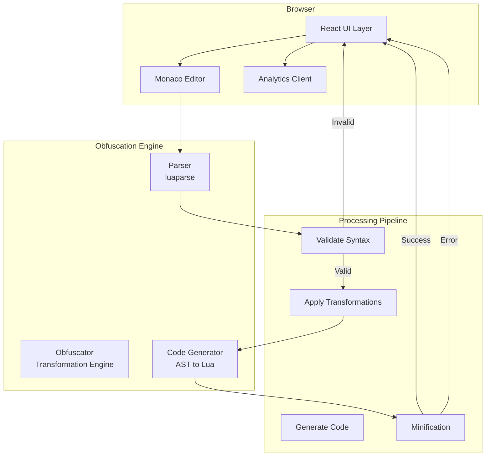
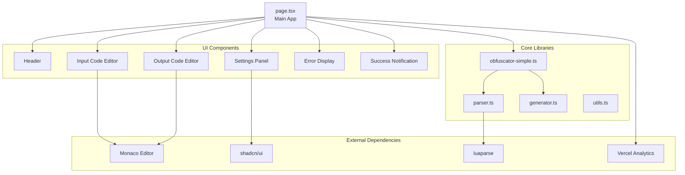
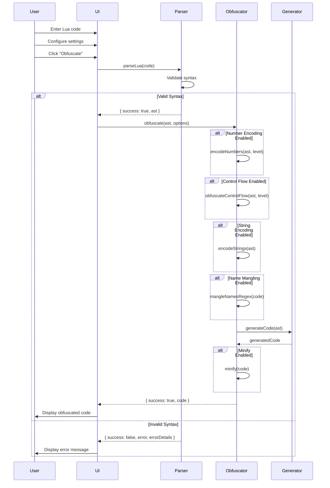

# Architecture Documentation

Comprehensive system architecture and design patterns for the Lua Obfuscator.

## Table of Contents

- [System Overview](#system-overview)
- [Architecture Diagrams](#architecture-diagrams)
- [Component Architecture](#component-architecture)
- [Data Flow](#data-flow)
- [Technology Stack](#technology-stack)
- [Design Patterns](#design-patterns)
- [Security Considerations](#security-considerations)
- [Scalability](#scalability)

---

## System Overview

The Lua Obfuscator is a browser-based web application that transforms Lua source code into functionally equivalent but harder-to-read code using multiple obfuscation techniques.

**Key Characteristics:**

- **Client-Side Processing:** All obfuscation happens in the browser (no server required)
- **Real-Time Transformation:** 100ms debounced processing for responsive UX
- **Production-Ready:** Comprehensive test coverage (160+ unit tests, 37+ E2E tests)
- **Modern Architecture:** Next.js 15+ App Router with React 19+

---

## Architecture Diagrams

### System Architecture



### Component Hierarchy



### Obfuscation Pipeline



---

## Component Architecture

### 1. Parser Layer (`lib/parser.ts`)

**Responsibility:** Syntax validation and AST generation

**Key Functions:**

```typescript
parseLua(code: string): ParseResult
validateLua(code: string): boolean
```

**Dependencies:**

- `luaparse` - Lua parser library

**Error Handling:**

- Extracts line/column information from parse errors
- Formats error messages for user display
- Supports multiple error message formats

**Design Pattern:** Wrapper pattern around luaparse with enhanced error handling

---

### 2. Transformation Engine (`lib/obfuscator-simple.ts`)

**Responsibility:** Code transformation and obfuscation

**Key Components:**

#### LuaObfuscator Class

```typescript
class LuaObfuscator {
	private nameMap: Map<string, string>;
	private counter: number;

	obfuscate(code: string, options: ObfuscationOptions): ObfuscationResult;
	private mangleNamesRegex(code: string): string;
	private encodeStrings(code: string): string;
	private encodeNumbers(code: string, level: number): string;
	private obfuscateControlFlow(code: string, level: number): string;
	private minify(code: string): string;
	private generateMangledName(): string;
}
```

**Transformation Order:**

1. **Number Encoding** (first to avoid encoding mangled names)
2. **Control Flow Obfuscation**
3. **String Encoding**
4. **Name Mangling**
5. **Minification** (last to clean up result)

**Protected Names:**

- Lua keywords (`if`, `then`, `else`, `end`, etc.)
- Standard library (`print`, `pairs`, `math`, `string`, etc.)
- Library functions (`char`, `byte`, `insert`, `remove`, etc.)

**Design Pattern:** Strategy pattern for transformation techniques

---

### 3. Code Generator (`lib/generator.ts`)

**Responsibility:** AST to Lua code conversion

**Supported Node Types:**

- Statements: `LocalStatement`, `AssignmentStatement`, `CallStatement`, `ReturnStatement`, `IfStatement`, `WhileStatement`, `RepeatStatement`, `ForNumericStatement`, `ForGenericStatement`, `DoStatement`, `BreakStatement`
- Expressions: `BinaryExpression`, `LogicalExpression`, `UnaryExpression`, `CallExpression`, `MemberExpression`, `IndexExpression`, `TableConstructorExpression`
- Literals: `NumericLiteral`, `StringLiteral`, `BooleanLiteral`, `NilLiteral`
- Functions: `FunctionDeclaration`
- Identifiers: `Identifier`

**Special Handling:**

- Encoded strings → `string.char(bytes...)`
- Encoded numbers → mathematical expressions
- Escaped strings → proper byte conversion
- Table constructors → various field types

**Design Pattern:** Visitor pattern for AST traversal

---

### 4. UI Layer (`app/page.tsx`)

**Responsibility:** User interface and interaction

**State Management:**

```typescript
const [inputCode, setInputCode] = useState<string>();
const [outputCode, setOutputCode] = useState<string>();
const [isProcessing, setIsProcessing] = useState<boolean>();
const [error, setError] = useState<string | null>();
const [inputError, setInputError] = useState<ParseError | undefined>();
const [settings, setSettings] = useState<ObfuscatorSettings>();
const [copySuccess, setCopySuccess] = useState<boolean>();
const [showSuccessAnimation, setShowSuccessAnimation] = useState<boolean>();
```

**Key Features:**

- Real-time obfuscation with 100ms debounce
- Monaco code editor with Lua syntax highlighting
- Configuration panel with 5 toggles + protection level slider
- Copy to clipboard and download functionality
- Error display with line/column highlighting
- Success notifications with animations

**Design Pattern:** Container/Presentational component pattern

---

## Data Flow

### Obfuscation Flow

```
User Input (Lua Code)
    ↓
[Validation] parseLua()
    ↓
[AST Generation] luaparse
    ↓
[Transformation Pipeline]
    ├─ encodeNumbers() → Numeric literal obfuscation
    ├─ obfuscateControlFlow() → Opaque predicates
    ├─ encodeStrings() → Byte array encoding
    ├─ mangleNamesRegex() → Identifier replacement
    └─ minify() → Whitespace/comment removal
    ↓
[Code Generation] generateCode()
    ↓
[Output] Obfuscated Lua Code
```

### State Updates

```
User Action (button click, input change, slider adjust)
    ↓
[Event Handler] React event system
    ↓
[State Update] setState()
    ↓
[Re-render] React reconciliation
    ↓
[UI Update] DOM manipulation
    ↓
[Visual Feedback] Animations, notifications, error displays
```

---

## Technology Stack

### Frontend Framework

| Technology | Version | Purpose                         |
| ---------- | ------- | ------------------------------- |
| Next.js    | 15.5.4  | React framework with App Router |
| React      | 19.2.0  | UI library                      |
| TypeScript | 5.9.3   | Type safety                     |

### UI Libraries

| Library       | Version | Purpose               |
| ------------- | ------- | --------------------- |
| Tailwind CSS  | 4.1.14  | Utility-first styling |
| shadcn/ui     | Latest  | Pre-built components  |
| Lucide React  | 0.545.0 | Icon library          |
| Monaco Editor | 4.7.0   | Code editor           |

### Obfuscation

| Library  | Version | Purpose    |
| -------- | ------- | ---------- |
| luaparse | 0.3.1   | Lua parser |

### Testing

| Framework              | Version | Purpose       |
| ---------------------- | ------- | ------------- |
| Jest                   | 29.7.0  | Unit testing  |
| @testing-library/react | 16.1.0  | React testing |
| Playwright             | 1.56.0  | E2E testing   |

### Code Quality

| Tool     | Version | Purpose    |
| -------- | ------- | ---------- |
| ESLint   | 9.37.0  | Linting    |
| Prettier | Latest  | Formatting |

### Analytics

| Service               | Version | Purpose                |
| --------------------- | ------- | ---------------------- |
| Vercel Analytics      | 1.5.0   | Page analytics         |
| Vercel Speed Insights | 1.2.0   | Performance monitoring |
| Google Analytics      | Latest  | Custom event tracking  |

---

## Design Patterns

### 1. Wrapper Pattern

**Used in:** `parser.ts`

**Purpose:** Enhance luaparse with better error handling

```typescript
export function parseLua(code: string): ParseResult {
	try {
		const ast = luaparse.parse(code, {
			locations: true,
			ranges: true,
			comments: false,
		});
		return { success: true, ast };
	} catch (error: any) {
		return {
			success: false,
			error: formatError(error),
			errorDetails: extractErrorDetails(error),
		};
	}
}
```

---

### 2. Strategy Pattern

**Used in:** `obfuscator-simple.ts`

**Purpose:** Interchangeable transformation algorithms

```typescript
// Number encoding strategies
switch (strategy) {
	case 0: // Split and add
		return `(${half} + ${remainder})`;
	case 1: // Multiply and divide
		return `(${num * multiplier} / ${multiplier})`;
	case 2: // Add and subtract
		return `(${num + offset} - ${offset})`;
}
```

---

### 3. Visitor Pattern

**Used in:** `generator.ts`

**Purpose:** AST traversal and code generation

```typescript
function generateNode(node: any): string {
	switch (node.type) {
		case "Chunk":
			return generateChunk(node);
		case "LocalStatement":
			return generateLocalStatement(node);
		case "BinaryExpression":
			return generateBinaryExpression(node);
		// ... 20+ node types
	}
}
```

---

### 4. Facade Pattern

**Used in:** `obfuscator-simple.ts`

**Purpose:** Simplify complex subsystem

```typescript
export function obfuscateLua(code: string, options?: ObfuscationOptions): ObfuscationResult {
	const obfuscator = new LuaObfuscator();
	return obfuscator.obfuscate(code, options);
}
```

---

### 5. State Machine Pattern

**Used in:** `page.tsx`

**Purpose:** UI state management

```
States:
- Idle (no code, no processing)
- Editing (code entered, not processed)
- Processing (obfuscation in progress)
- Success (obfuscated code ready)
- Error (obfuscation failed)

Transitions:
- Idle → Editing: User types code
- Editing → Processing: User clicks "Obfuscate"
- Processing → Success: Obfuscation succeeds
- Processing → Error: Obfuscation fails
- Success → Editing: User modifies code
- Error → Editing: User fixes error
```

---

## Security Considerations

### 1. Client-Side Processing

**Advantage:** No server-side storage of user code

**Risk:** Code visible in browser memory/DevTools

**Mitigation:** Warn users not to obfuscate sensitive data

---

### 2. Obfuscation Strength

**Limitation:** Not cryptographically secure

**Purpose:** Code obscurity, not encryption

**Warning:** Determined attackers can reverse-engineer obfuscated code

---

### 3. Input Validation

**Protection:** Parser validates all input before processing

**Error Handling:** Graceful error display without crashing

**Sanitization:** No need for HTML escaping (code editor handles this)

---

### 4. Analytics Privacy

**Data Collected:**

- Obfuscation type (mangle, encode, minify)
- Code size (length in characters)
- Protection level (0-100)

**Not Collected:**

- Actual code content
- User identifiers
- IP addresses (beyond standard Vercel logging)

---

### 5. XSS Prevention

**Risk:** User-provided Lua code could contain malicious content

**Mitigation:**

- Monaco editor sanitizes all input
- Code is never executed on client
- No innerHTML usage with user content

---

## Scalability

### Browser Performance

**Optimization Strategies:**

1. **Debouncing:** 100ms delay prevents excessive processing
2. **Timeouts:** Processing wrapped in setTimeout to prevent UI blocking
3. **Chunking:** Large code processed in manageable chunks
4. **Memory Management:** Name map cleared between obfuscations

**Performance Metrics:**

| Code Size | Processing Time | Memory Usage |
| --------- | --------------- | ------------ |
| < 1KB     | < 50ms          | < 5MB        |
| 1-10KB    | 50-200ms        | 5-20MB       |
| 10-100KB  | 200-1000ms      | 20-50MB      |
| > 100KB   | > 1s            | > 50MB       |

---

### Code Editor Performance

**Monaco Editor Optimization:**

- Dynamic import to reduce initial bundle size
- Lazy loading of Lua language support
- Virtual scrolling for large files
- Syntax highlighting with Web Workers

**Recommended Limits:**

- Input code: < 100KB (10,000 lines)
- Output code: < 500KB (50,000 lines)

---

### Bundle Size

**Current Bundle Sizes:**

| Bundle        | Size   | Loaded     |
| ------------- | ------ | ---------- |
| Main JS       | ~400KB | Initial    |
| Monaco Editor | ~800KB | Dynamic    |
| luaparse      | ~100KB | Initial    |
| Total Initial | ~500KB | First load |

**Optimization:**

- Tree-shaking removes unused code
- Code splitting for Monaco editor
- Compression (gzip/brotli) on Vercel

---

### Deployment Architecture

```
User Browser
    ↓
[CDN] Vercel Edge Network
    ↓
[Static Assets]
    ├─ HTML
    ├─ JavaScript bundles
    ├─ CSS
    └─ Fonts
    ↓
[Server-Side Rendering] Next.js (minimal)
    ↓
[Analytics API] /api/analytics endpoint
```

**Characteristics:**

- Static generation for main page
- Client-side rendering for code editor
- Server-side analytics tracking (optional)
- Global CDN distribution

---

## Testing Architecture

### Unit Tests (`__tests__/unit/`)

**Coverage:**

- Parser: Syntax validation, error handling
- Obfuscator: All transformation techniques
- Generator: AST to code conversion

**Framework:** Jest with @testing-library/react

**Test Count:** 160+ tests across 4 suites

---

### E2E Tests (`__tests__/e2e/`)

**Scenarios:**

- Full obfuscation workflow
- Responsive design (mobile, tablet, desktop)
- Error handling and recovery
- Accessibility compliance
- Analytics tracking

**Framework:** Playwright

**Browser Coverage:**

- Chrome (Desktop + Mobile)
- Firefox (Desktop)
- Safari (Desktop + iPad)

**Test Count:** 37+ tests across 6 configurations

---

### Integration Tests

**Round-Trip Validation:**

```
Original Code
    ↓
[Obfuscate] → Obfuscated Code
    ↓
[Parse] → AST
    ↓
[Validate] → Success/Failure
```

**Test Cases:**

- Fibonacci function
- Factorial calculation
- Quicksort algorithm
- Inventory system (complex tables/metatables)

---

## Maintenance and Evolution

### Code Organization

**Directory Structure:**

```
web/
├── app/                    # Next.js App Router
│   ├── api/analytics/     # Analytics endpoint
│   ├── layout.tsx         # Root layout
│   ├── page.tsx           # Main UI
│   └── globals.css        # Global styles
├── components/            # React components
│   ├── CodeEditor.tsx     # Monaco wrapper
│   ├── BackgroundGradient.tsx
│   └── ui/                # shadcn components
├── lib/                   # Core logic
│   ├── parser.ts          # Lua parsing
│   ├── obfuscator-simple.ts  # Obfuscation engine
│   ├── generator.ts       # Code generation
│   ├── analytics-client.ts
│   ├── analytics-server.ts
│   └── utils.ts
├── __tests__/             # Test suites
│   ├── unit/lib/
│   ├── integration/
│   └── e2e/
└── types/                 # TypeScript definitions
```

---

### Extension Points

**Adding New Obfuscation Techniques:**

1. Add option to `ObfuscationOptions` interface
2. Implement transformation function in `LuaObfuscator`
3. Add to transformation pipeline in `obfuscate()`
4. Update protection level mapping
5. Write unit tests
6. Update documentation

**Example:**

```typescript
// 1. Add option
interface ObfuscationOptions {
  // ...
  deadCodeInjection?: boolean;
}

// 2. Implement transformation
private injectDeadCode(code: string): string {
  // Implementation...
}

// 3. Add to pipeline
if (options.deadCodeInjection) {
  obfuscatedCode = this.injectDeadCode(obfuscatedCode);
}
```

---

### Future Enhancements

**Planned Features:**

1. **Advanced Obfuscation:**
   - Dead code injection
   - String array rotation
   - Function inlining
   - Constant folding

2. **Performance:**
   - Web Worker processing
   - Streaming obfuscation
   - Progressive enhancement

3. **Developer Experience:**
   - CLI version
   - API endpoint
   - VS Code extension
   - npm package

4. **Analytics:**
   - Obfuscation success rate
   - Popular technique combinations
   - Performance benchmarks

---

## References

**External Documentation:**

- [Next.js Documentation](https://nextjs.org/docs)
- [React Documentation](https://react.dev)
- [luaparse Documentation](https://oxyc.github.io/luaparse/)
- [Monaco Editor Documentation](https://microsoft.github.io/monaco-editor/)

**Related Projects:**

- [Prometheus Obfuscator](https://github.com/levno-710/Prometheus)
- [LuaSrcDiet](https://github.com/jirutka/luasrcdiet)
- [IronBrew2](https://github.com/Stnby/IronBrew2)
